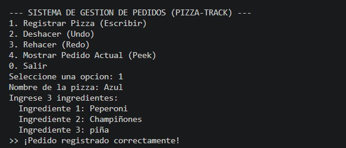
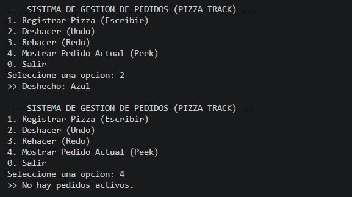
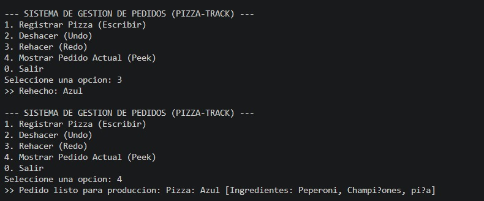

# Sistema de Gestión de Pedidos - Pizza-Track (Undo/Redo)

## Objetivo de la Actividad
Comprender y aplicar la estructura de datos lineal **Pila (LIFO)** mediante una implementación manual basada en **listas ligadas (Nodos)** en Java. El proyecto simula el sistema de gestión de pedidos de una pizzería, permitiendo realizar operaciones de registro, deshacer (*Undo*) y rehacer (*Redo*), combinando el uso de arreglos de tamaño fijo y control de versiones con Git/GitHub.

---

## Arquitectura del Proyecto
El proyecto está estructurado de forma modular en 4 clases Java dentro de la carpeta `src`:
* **`Pizza.java`**: Modelo de datos que contiene el nombre de la pizza y un arreglo de tamaño fijo (3) para sus ingredientes.
* **`Nodo.java`**: Elemento de la lista ligada manual que contiene la referencia al objeto `Pizza` y la dirección del nodo `siguiente`.
* **`Pila.java`**: Estructura Pila manual con operaciones fundamentales (`push`, `pop`, `peek`, `isEmpty`).
* **`GestionPedidos.java`**: Clase principal que coordina el menú interactivo mediante dos pilas manuales (`pilaPrincipal` para Undo y `pilaSecundaria` para Redo).

---

# Pizza-Track (Sistema de Pedidos)

## Objetivo
Simulador de gestión de pedidos para una pizzería en Java utilizando dos pilas manuales basadas en listas ligadas (Nodos) para el control de Undo/Redo.

---

## Pruebas de Ejecución

### 1. Registro de Pedido
Muestra el ingreso del nombre y el arreglo de 3 ingredientes en la pila principal.

### 2. Deshacer Pedido (Undo)
Se ejecuta la opción 2 para retirar el pedido de la pila principal y enviarlo a la pila secundaria.

### 3. Rehacer Pedido (Redo)
Se ejecuta la opción 3 para recuperar el pedido deshecho desde la pila secundaria hacia la principal.

---

## Sustentación Individual
* **Video de Sustentación:** [https://youtu.be/I_lyoARq1yY?si=qK6aqsi4tcdIM9_B]